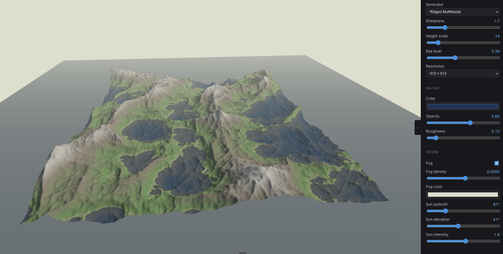
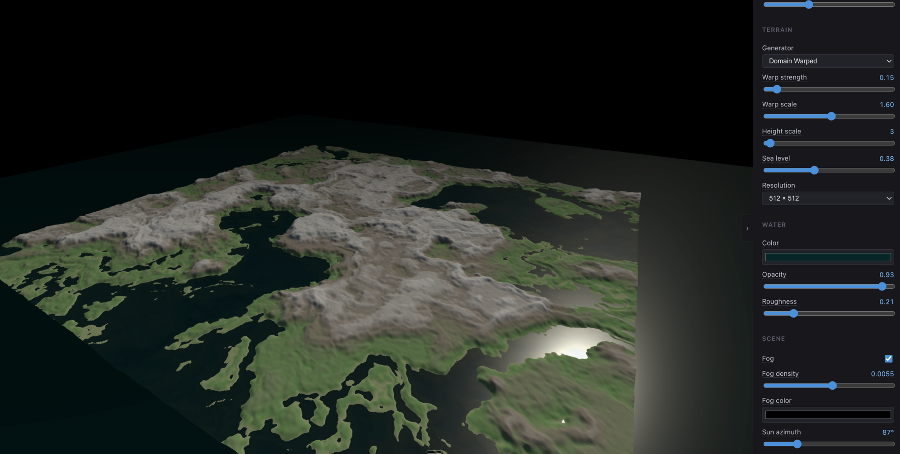
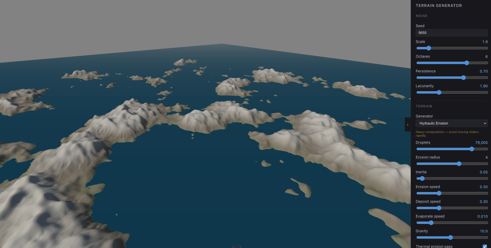

# Terrain Generator

A browser-based procedural terrain generator for exploring and comparing different heightmap generation algorithms. Built with Svelte 5, Three.js, and TypeScript.

**Live demo:** https://terrain-generator-ashen.vercel.app/

## Generators

| Algorithm               | Description                                                                                                                                                                                                 |
| ----------------------- | ----------------------------------------------------------------------------------------------------------------------------------------------------------------------------------------------------------- |
| **Simplex fBm**         | Fractal Brownian Motion layering multiple octaves of simplex noise. The baseline algorithm — smooth, natural-looking terrain with controllable roughness.                                                   |
| **Domain Warped**       | Quilez-style coordinate displacement where a second noise field warps the input coordinates before sampling the main noise. Produces flowing, organic shapes with streaked valleys.                         |
| **Ridged Multifractal** | Inverts and sharpens each noise octave to produce sharp mountain ridges and deep valleys instead of rolling hills.                                                                                          |
| **Hydraulic Erosion**   | Particle-based water simulation: thousands of droplets flow downhill, eroding steep faces and depositing sediment in valleys. Optional thermal erosion pass smooths the resulting cliffs into scree slopes. |

All generators share common noise parameters (seed, scale, octaves, persistence, lacunarity) and scene controls (fog, sun azimuth/elevation/intensity).

## Screenshots

Ridged Multifractal with fog:



Domain Warped with dark fog:



Hydraulic Erosion archipelago:



## Running locally

```
npm install
npm run dev
```

## Tech stack

- [Svelte 5](https://svelte.dev) + [Vite](https://vitejs.dev)
- [Three.js](https://threejs.org) — WebGL rendering, OrbitControls
- [simplex-noise](https://github.com/jwagner/simplex-noise) — noise primitives
- [Vitest](https://vitest.dev) — unit tests for all terrain math (`npm run test`)
